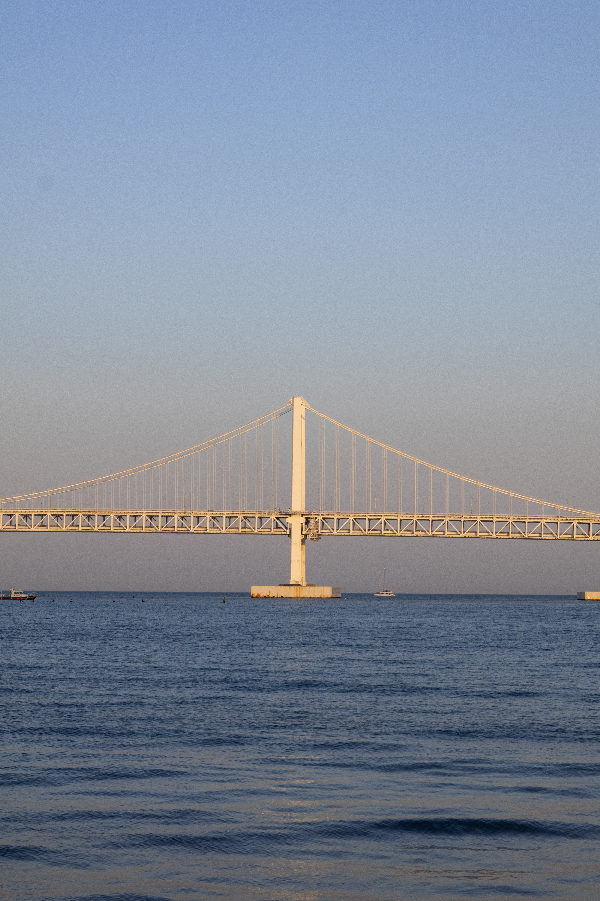
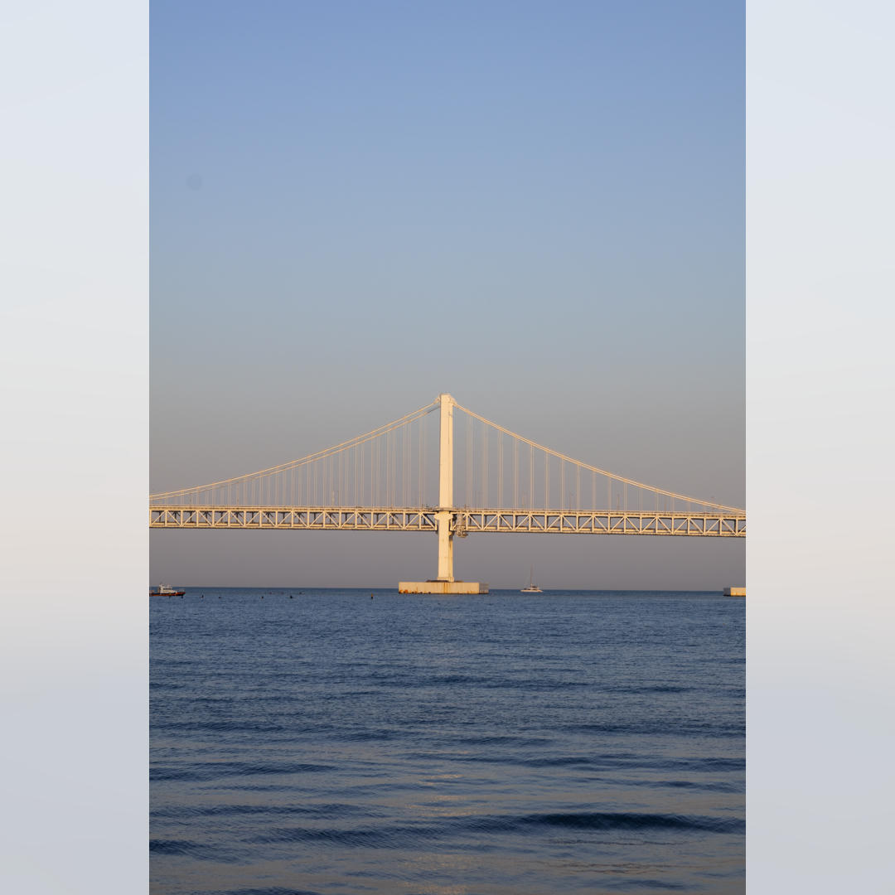

# img2rect

사진을 1080x1080 크기의 정사각형으로 변환시켜주는 도구입니다. 인스타그렘 피드에 서로 다른 크기의 사진을 편하게 함께 올리기 위해 만들었답니다.

사진을 축소함으로써 생기는 여백은 동일한 사진에 확대, 가우시안 블러, 투명도를 적용한 사진으로 채워요.

| 원본 | 결과 |
|---|---|
|  |  |

혼자 쓰려고 만들거라 예외 처리 및 에러 메시지를 다듬지 않았어요. 이점 유의해주세요.

## 사용법

```bash
cd <project dir>
cargo build --release
```

```bash
./img2rect ./path/to/image.jpg
```

```bash
./img2rect --help

# Usage: img2rect [PATH]...
#
# Arguments:
#   [PATH]...  
#
# Options:
#   -h, --help     Print help
#   -V, --version  Print version
```
